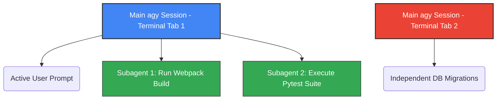

# Google Antigravity CLI (`agy`) Developer Guide

Welcome to the ultimate guide for **Antigravity CLI** (invoked via `agy`), the Go-based, terminal-first AI pair programming agent developed by Google. As the successor to the Node-based Gemini CLI, `agy` is engineered for lightning-fast speeds, remote SSH operations, keyboard-driven workflows, and complex multi-agent orchestration.

This document covers all the features, commands, flags, configurations, and best practices to supercharge your development terminal environment, including a deep-dive on **Multi-Terminal** architecture.

---

## 🚀 Architectural Overview & Core Concepts

Unlike standard conversational CLI wrappers, the Antigravity CLI represents an **agentic terminal environment**. It doesn't just chat; it actively interacts with your operating system, builds code, runs tests, and delegates background tasks.

### Core Capabilities:
1. **Low Latency & High Efficiency:** Built in Go, it features extremely quick startup times and minimal memory footprint compared to its Node.js predecessor.
2. **Autonomy & Safe Containment:** The CLI features a sophisticated permission system and terminal sandboxing to safely isolate run-time commands while maintaining productive automation.
3. **Multi-Agent Engine:** It operates a parent-child coordination model, enabling you to spin up independent subagents to solve complex, parallel coding problems while keeping your main terminal active.

---

## 🛠️ CLI Launch Flags & Configurations

When starting `agy` from your shell, you can control its initial behavior and permission scopes using runtime options.

### 1. Command-Line Launch Options

| Flag | Shortcut | Purpose | Example |
| :--- | :--- | :--- | :--- |
| `--conversation <ID>` | `-c <ID>` | Resume a specific prior conversation session. | `agy -c a8f2-39bd` |
| `--sandbox` | None | Force execution inside the containerized sandbox environment. | `agy --sandbox` |
| `--dangerously-skip-permissions` | None | Bypass confirmation prompts for standard/repetitive operations (exercise caution!). | `agy --dangerously-skip-permissions` |
| `--version` | `-v` | Output the current version of the CLI tool. | `agy -v` |
| `--help` | `-h` | Output standard command-line options and quick help. | `agy -h` |

---

## ⌨️ Interactive Slash Commands

Once inside an active `agy` session, you control the environment using **slash commands** entered directly into the prompt. 

### Essential Command Reference

> [!TIP]
> You can trigger autocomplete for these commands at any time by typing `/` in the prompt.

* **`/help` or `?`**
  * Opens the inline interactive manual displaying active shortcuts, commands, and key bindings.
* **`/config` or `/settings`**
  * Launches the full-screen terminal configuration overlay to adjust theme, reasoning models, safety filters, and file scopes.
* **`/keybindings`**
  * Opens the interactive keyboard shortcut manager to customize hotkeys.
* **`/permissions`**
  * View, grant, or revoke fine-grained read/write/execution access lists (e.g., allowing automatic `git` execution without prompts).
* **`/agents`**
  * Opens the interactive multi-agent control panel where you can monitor, send messages to, or terminate parallel subagents.
* **`/tasks`**
  * View and manage general background processes (e.g., builds, test runners).
* **`/resume` or `/switch`**
  * Displays a visual list of your historical conversations to easily swap between active projects.
* **`/rewind` or `/undo`**
  * Steps the conversation state back to a previous turn—perfect for correcting a false path without starting over.
* **`/fork`**
  * Duplicates the current chat context and workspace branch into a new session, allowing risk-free architectural experimentation.
* **`/export`**
  * Instantly hand off your active CLI conversation to the full **Antigravity 2.0 Desktop Application** if you need a graphical UI.
* **`/logout`**
  * Cleans cached auth tokens, terminates active agent runtimes, and exits securely.

---

## ⚡ Keyboard Shortcuts & Power Tricks

Because `agy` is built for keyboard-centric power users, it supports global hotkeys to keep your hands on the home row.

* **`Ctrl + k` (Quick-Approve):** Instantly approve a subagent's pending permission request without interrupting your active chat/code stream.
* **`Ctrl + j` (Teleport Focus):** Automatically switch focus to the next subagent workspace awaiting action or approval.
* **`Esc + Esc` (Reset Input):** Quickly clear out the prompt input box when no streaming is running.
* **`@` (Path Autocomplete):** Triggers directory and file search dropdowns inline to import context quickly.
* **`!` (Direct Shell Execution):** Prefix any line with `!` to execute a terminal command locally instead of prompting the agent (e.g., `!git status` or `!npm run dev`).

---

## ⚙️ Configuration Files (`settings.json`)

Your settings are persisted globally in a JSON format. This file is located under your user profile:
* **Windows:** `C:\Users\<username>\.gemini\antigravity-cli\settings.json`
* **Linux/macOS:** `~/.gemini/antigravity-cli/settings.json`

### Example `settings.json`

```json
{
  "colorScheme": "dark-glassmorphic",
  "model": "Gemini 3.5 Flash (High)",
  "enableTerminalSandbox": true,
  "trustedWorkspaces": [
    "C:/Python/Openpyxl/GPU",
    "C:/Developer/WebApps"
  ],
  "permissions": {
    "command(git)": "allow",
    "command(npm)": "ask",
    "read_file(*)": "allow"
  }
}
```

---

## 🖥️ Multi-Terminal Support Analysis

One of the most common questions is whether the Antigravity CLI supports **multi-terminal** configurations. 

### The short answer is: **Yes, absolutely!** However, it is designed with a specific architecture.

Rather than acting as a terminal multiplexer (like tmux or screen), `agy` integrates cleanly into multi-terminal setups through the following mechanisms:

### 1. Isolated Parallel Sessions (Tab/Window Isolation)
When you open multiple terminal tabs or windows and run `agy`, each instance runs as an **independent, isolated session**. 
* **No Cross-Contamination:** Memory and local context are kept distinct per terminal. You can safely refactor a backend server in Tab 1 while debugging frontend CSS changes in Tab 2 without the agent getting confused.
* **Shared Global Config:** All open instances read from the same `settings.json` and share the same plugins, keybindings, and active Model Context Protocol (MCP) integrations.

### 2. Multi-Agent Orchestration (Virtual Terminals)
Instead of opening multiple physical terminal windows to run parallel tasks, `agy` implements **Subagents** inside a single terminal view.
* When you launch a subagent (via `/agents` or when `agy` recommends it), a virtual workspace is spun up in the background.
* This allows you to compile code, run tests, and search files concurrently on different virtual workers, all managed through your primary `agy` prompt.



### 3. State Syncing via MCP (Long-Term Cross-Terminal Memory)
If you want multiple terminal windows to share a continuous "memory" or share context about what you are building:
* You can connect a central key-value or memory provider (like the **Mem0 MCP Server**) to your configuration.
* Because all terminals connect to the same MCP endpoint, information learned in Terminal A (e.g., *"We are using port 8080 for this project"*) is automatically accessible to the agent running in Terminal B.

### 4. IDE Embedded Terminals (JetBrains & VS Code)
If you operate a multi-pane IDE layout with various embedded terminals, the **Antigravity Companion Plugin** links your CLI terminals directly to the active IDE window state. As you switch tabs, `agy` is aware of the file focus and editor coordinates across all active panels.

---

> [!NOTE]
> For advanced remote SSH scenarios, if you run multiple remote shells to the same server, `agy` will seamlessly handle auth tokens across all connection points utilizing your system's keyring securely.
